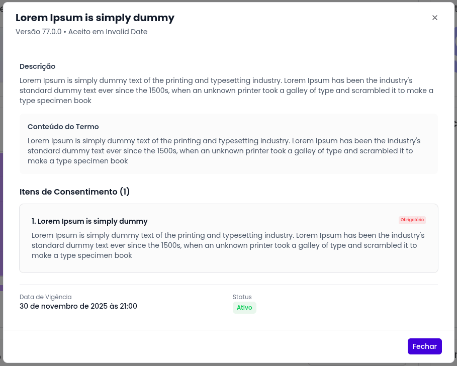

<h1 align="center">4° Semestre</h1>

  Olá, meu nome é Eduardo Farias, tenho 24 anos de idade, moro em Jacareí - São Paulo, Brasil. 
  Estou cursando Tecnologia em Banco de Dados na Fatec-SJC

## Contatos:

## Meus Principais Conhecimentos:

  
  
  
  
  
  
  
  

 
 

 

<h1>Geotrack</h1>

<h4> 4° Semestre • <a href="https://github.com/iNineBD/GeoTrack-4Sem2024Main">Repositório Github</a></h4>

 Empresa Parceira • <a href="https://www.linkedin.com/company/ito1/posts/?feedView=all">ITO1</a>

</img>

Desenvolvimento de uma aplicação tecnológica voltada para a realização de avaliações 360°, com foco em promover uma análise democratizada de desempenho e comportamento dentro de equipes e organizações.

A aplicação permite que os usuários conduzam avaliações completas, com múltiplas perspectivas, oferecendo uma visão abrangente dos pontos fortes e oportunidades de melhoria de cada avaliado.

  
VER MAIS DETALHES

  
  <h2>Objetivo</h2>

#### Após a finalização do projeto pela equipe iNine:

- O sistema permitirá o cadastro e gestão de clientes, soluções e usuários autorizados a configurar os dados.
- O usuário poderá realizar upload de dados com visualização e validação da estrutura dos dados, incluindo campos, tipos e regras de negócios.
- O usuário poderá aplicar regras de negócios, como mapeamento “de/para”, facilitando a padronização dos dados.
- O sistema disponibilizará um dashboard analítico que permitirá uma visão quantitativa e completa das configurações realizadas.
- O usuário poderá acompanhar e gerenciar a configuração completa dos dados através de uma interface analítica, proporcionando uma visão detalhada e consolidada de todo o processo.

 

<h2>Tecnologias Utilizadas no Projeto</h2>

<strong>Java JDK 21.0.2:</strong> linguagem utilizada para desenvolvimento do backend.

<strong>Spring Boot 3.3.2:</strong> framework utilizado para desenvolvimento do backend.

<strong>MySQL:</strong> SGBD para desenvolvimento do Banco de Dados.

<strong>HTML5:</strong> linguagem de marcação utilizada para o desenvolvimento do frontend.

<strong>CSS3:</strong> linguagem de estilização utilizada para o desenvolvimento do frontend.

<strong>JavaScript:</strong> linguagem utilizada para desenvolvimento do frontend.

<strong>Vue.js 2.6.12:</strong> framework utilizado para desenvolvimenton do frontend.

<strong>ClickUp:</strong> ferramenta utilizada para o gerenciamento do projeto.

<strong>Figma:</strong> ferramenta utilizada para prototipar as telas.

<strong>IntelliJ IDEA:</strong> IDE utilizada para o desenvolvimento backend dos códigos da aplicação.

<strong>Visual Studio Code:</strong> IDE utilizada para o desenvolvimento frontend dos códigos da aplicação.

<strong>Postman:</strong> ferramenta utilizada para criar, compartilhar, testar e documentar APIs.

 
 

<h2>Minhas Contribuições</h2>

> Contribuí ativamente como desenvolvedor frontend, desempenhando um papel crucial na arquitetura e estilização das páginas, como também a prototipação das telas.

### 1. **Prototipação e criação das telas**

- Contribuí ativamente com a prototipação, criação e correção das telas para manter um padrão no frontend e melhorar a usabilidade do usuário.

  
Detalhes 1

  

  
Detalhes 2

  

### 2. **Desenvolvimento da Tela da Landing Zone**

- Contribui ativamente com o desenvolvimento da tela landing zone, onde o usuário pode fazer a tipagem dos metadados do arquivo que ele fez o upload, podendo escolher Nome, Tipo do dado, Obrigatoriedade, Tamanho maximo, Valor padrão e Descrição.

  
Detalhes

  
  

### 3. **Desenvolvimento das Telas de Validação**

- Contribui ativamente com o desenvolvimento das telas de validação, onde o usuário pode visualizar os metadados que ele fez o upload e pode validar se está correto ou não.

  
Detalhes Tela Validação

  

### 4. **Desenvolvimento dos DashBoards de Usuarios e Arquivos**

- Contribui ativamente com o desenvolvimento dos dashboards de usuários e organizações, permitindo uma visualização quantitativa de usuarios por organização e quantidade de arquivos por etapa filtrando-os por organização.

  
Detalhes Dashboard de Usuarios

  

  
Detalhes Dashboard de Arquivos

  

### 5. **Desenvolvimento da Tela de Navegação e Download Yamls**

- Contribuí ativamente com o desenvolvimento da tela de navegação, onde o usuário pode navegar entre as etapas do processo de configuração de dados que estão disponíveis para ele.
- Contribuí ativamente com o desenvolvimento da funcionalidade de download yamls, onde o usuário pode fazer o download dos arquivos yamls que ele configurou.

  
Detalhes Tela de Navegação

  

### 6. **Experiencia como Scrum Master**

- Contribuí ativamente como Scrum Master, auxiliando a equipe a manter o foco nas entregas, garantindo que as reuniões diárias fossem realizadas e que os prazos fossem cumpridos.
- Contribuí ativamente com a organização do projeto, mantendo o ClickUp atualizado e organizado, garantindo que todos os membros da equipe estivessem cientes das tarefas a serem realizadas.

  
Detalhes Sobre as entregas nas Sprints

    <a href="https://sharing.clickup.com/9014018291/l/h/6-901402031898-1/593ce5b9097067b">Sprint 1</a>
     
    <a href="https://sharing.clickup.com/9014018291/l/h/6-901402031922-1/7151a40ba00853d">Sprint 2</a>
     
    <a href="https://sharing.clickup.com/9014018291/l/h/6-901402031924-1/99b04f0e3ba7763">Sprint 3</a>
     
    <a href="https://sharing.clickup.com/9014018291/l/h/6-901402031926-1/b8e3065e7467035">Sprint 4</a>

<h2>Conhecimentos Obtidos</h2>

Durante o desenvolvimento dessa aplicação, a experiência me proporcionou uma compreensão abrangente do ciclo de vida do desenvolvimento de software, desde a gestão ágil do projeto até a implementação eficaz no frontend, o trabalho em equipe e todo o conhecimento que adquiri sobre experiência de usuário para ter telas bem intuitivas e fáceis de usar e entender.

<h3>Hard Skills</h3>
  <table>
    <tr>
      <th width="300px">Tecnologia/Metodologia</th>
      <th width="300px">Classificação</th>
    </tr>
    <tr>
      <td>HTML5</td>
      <td align="center">★★★★★</td>
    </tr>
    <tr>
      <td>CSS3</td>
      <td align="center">★★★★☆</td>
    </tr>
    <tr>
      <td>JavaScript</td>
      <td align="center">★★★★☆</td>
    </tr>
    <tr>
      <td>Vue.js</td>
      <td align="center">★★★☆☆</td>
    </tr>
    <tr>
      <td>ClickUp</td>
      <td align="center">★★★★☆</td>
    </tr>
    <tr>
      <td>Figma</td>
      <td align="center">★★★☆☆</td>
    </tr>
    <tr>
      <td>Visual Studio Code</td>
      <td align="center">★★☆☆☆</td>
    </tr>
    <tr>
      <td>Postman</td>
      <td align="center">★★☆☆☆</td>
    </tr>
  </table>

<h3>Soft Skills </h3>
  <table>
    <tr>
      <th width="300px">Habilidade</th>
      <th width="300px">Classificação</th>
    </tr>
    <tr>
      <td>Proatividade</td>
      <td align="center">★★★★☆</td>
    </tr>
    <tr>
      <td>Autonomia e Visão de Negócio</td>
      <td align="center">★★★★☆</td>
    </tr>
    <tr>
      <td>Comunicação e Colaboração</td>
      <td align="center">★★★★★</td>
    </tr>
    <tr>
      <td>Organização, Planejamento e Entrega</td>
      <td align="center">★★★★☆</td
    </tr>
 </table>

