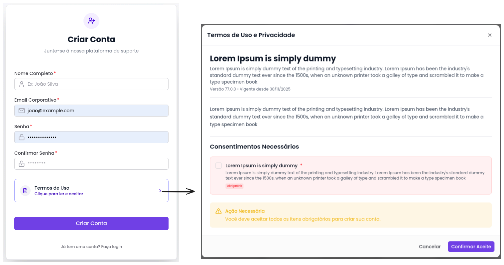
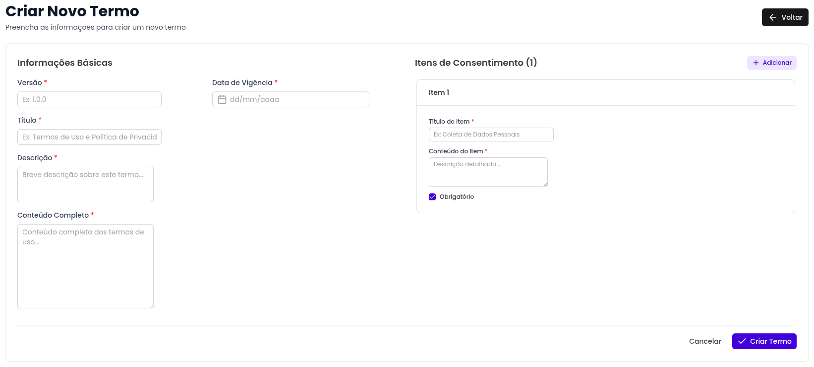
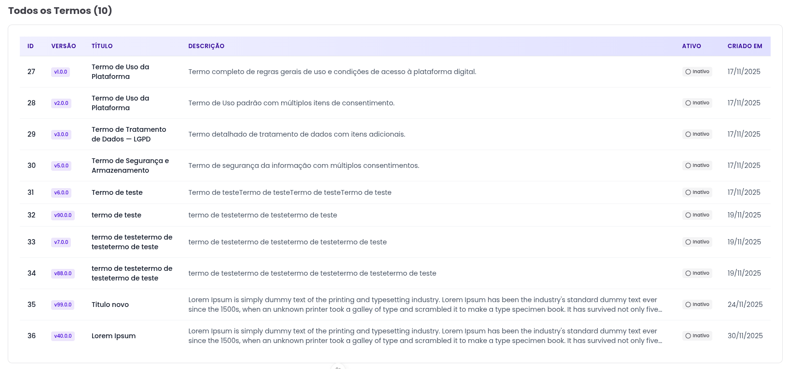
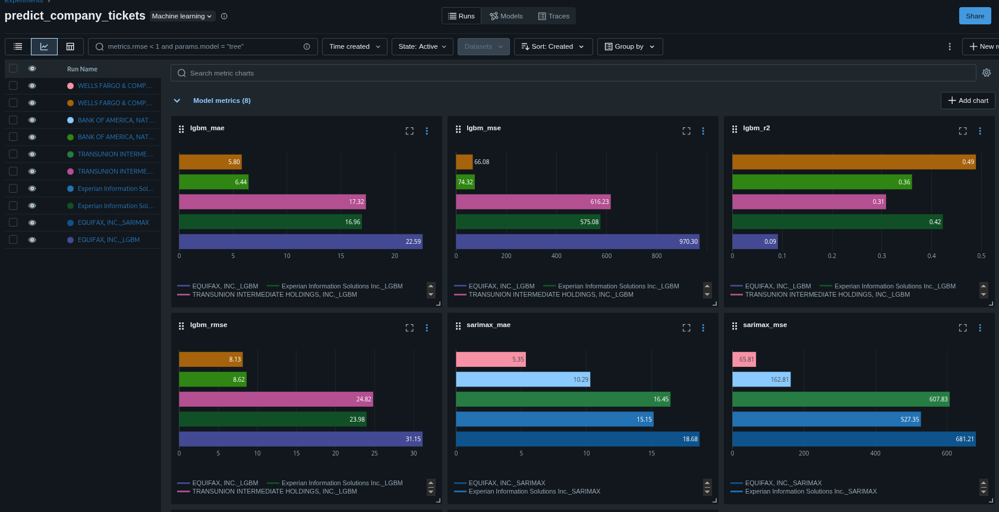

### Olá, meu nome é Eduardo Farias, tenho 24 anos de idade, moro em Jacareí - São Paulo, Brasil

### Sou formado em Tecnologia em Banco de Dados na Fatec-SJC

## Contatos

[](https://www.linkedin.com/in/eduardofariasp/)
[](https://github.com/eduardofpaula)

<h1 align="center">1° Semestre</h1>

<h1 align="center">Avaliação 360º</h1>

### 1° Semestre • [Repositório Github](https://github.com/iNineBD/Aval360-1Sem2023)

### Empresa Parceira • Fatec-SJC

<p align="center"></img>

Desenvolvimento de uma aplicação tecnológica voltada para a realização de avaliações 360°, com foco em promover uma análise democratizada de desempenho e comportamento dentro de equipes e organizações.

A aplicação permite que os usuários conduzam avaliações completas, com múltiplas perspectivas, oferecendo uma visão abrangente dos pontos fortes e oportunidades de melhoria de cada avaliado.

---
  
## Objetivo do Projeto Avaliação 360º

- Desenvolver uma aplicação tecnológica para a realização de avaliações 360°.
- Promover uma análise democratizada e colaborativa de desempenho e comportamento em equipes e organizações.
- Permitir que as avaliações sejam feitas a partir de múltiplas perspectivas (pares, líderes, subordinados e autoavaliação).
- Fornecer uma visão abrangente dos pontos fortes e das oportunidades de melhoria de cada avaliado.
- Incentivar a cultura de feedback contínuo e construtivo dentro das organizações.

## Tecnologias Utilizadas no Projeto

- **Python:** Linguagem principal utilizada no desenvolvimento da aplicação.
- **Excel:** Utilizado para o acompanhamento do progresso do projeto, criação do gráfico de burndown e controle de tarefas.
- **Git:** Ferramenta de versionamento de código, garantindo rastreabilidade e colaboração entre os membros do time.
- **Visual Studio Code:** IDE principal utilizada no desenvolvimento, com extensões que facilitaram a produtividade e organização do código.
- **Discord:** Plataforma usada para comunicação contínua e alinhamento entre os membros da equipe durante todas as fases do projeto.


## Minhas Contribuições

> Neste projeto, fui responsável pela documentação e pela estilização da interface no terminal. Organizei todas as informações de forma clara e objetiva, facilitando a compreensão do funcionamento da aplicação.

### 1. **Documentação do Projeto**

- Criação de um documento abrangente que descreve a arquitetura da aplicação, suas funcionalidades e instruções de uso.

- Criação do README.md do projeto, que inclui informações sobre o propósito da aplicação, tecnologias utilizadas, como contribuir e como executar o projeto localmente.

#### Detalhes 1

- [Documentação Avaliação 360º](https://github.com/iNineBD/Aval360-1Sem2023/blob/main/README.md)

### 2. **Estilização da Interface Terminal**

- Contribui ativamente com a estilização da interface no terminal, utilizando cores e formatação para tornar a experiência do usuário mais agradável e intuitiva.

```python
# Texto amarelo e em negrito
print("\033[1;33mCarregando dados...\033[m")

# Texto azul com itálico
print("\033[3;34mConexão estabelecida com sucesso.\033[m")

# Texto com fundo vermelho e texto branco
print("\033[1;37;41mERRO CRÍTICO: Falha na autenticação!\033[m")

# Menu com cores diferentes
print("\033[1;36m[1]\033[m Iniciar avaliação")
print("\033[1;36m[2]\033[m Ver resultados")
print("\033[1;36m[3]\033[m Sair")

# Título com duplo destaque: sublinhado e azul-claro
print("\033[4;96mRELATÓRIO DE DESEMPENHO\033[m")
```

- Essas formatações ajudam a guiar o usuário no terminal, diferenciando ações, alertas, títulos e menus.

### 3. **Desenvolvimento das Documentações de Sprint**

- Contribuí ativamente com a documentação das sprints, detalhando as entregas e o progresso do projeto, garantindo que todos os membros da equipe estivessem cientes das metas e objetivos.

**Detalhes Documentação de Sprint:**

- [Sprint 1](https://github.com/iNineBD/Aval360-1Sem2023/wiki/Sprint-1-iNine)
- [Sprint 2](https://github.com/iNineBD/Aval360-1Sem2023/wiki/Sprint-2-iNine)
- [Sprint 3](https://github.com/iNineBD/Aval360-1Sem2023/wiki/Sprint-3-iNine)
- [Sprint 4](https://github.com/iNineBD/Aval360-1Sem2023/wiki/Sprint-4-iNine)

### 4. **Geração e Entendimento de Burndown Chart**

- Utilizei o Excel para criar e acompanhar o gráfico de burndown, que é uma ferramenta essencial para monitorar o progresso do projeto e garantir que as metas sejam alcançadas dentro do prazo estipulado.

**Gráficos de Burndown Chart:**


### Conhecimentos Obtidos

- Durante o desenvolvimento dessa aplicação, a experiência me proporcionou uma compreensão abrangente do ciclo de vida do desenvolvimento de software, desde a gestão ágil do projeto até a implementação eficaz no frontend, o trabalho em equipe e todo o conhecimento que adquiri sobre experiência de usuário para ter telas bem intuitivas e fáceis de usar e entender.</p>

### Hard Skills

| Tecnologia/Metodologia    | Classificação |
|---------------------------|:------------:|
| Python                    |   ★★★★☆      |
| Excel                     |   ★★☆☆☆      |
| Git                       |   ★★★☆☆      |
| Visual Studio Code        |   ★★★★☆      |
| Documentação              |   ★★★★☆      |

### Soft Skills

| Habilidade                        | Classificação |
|------------------------------------|:------------:|
| Proatividade                      |   ★★☆☆☆      |
| Autonomia e Visão de Negócio       |   ★☆☆☆☆      |
| Comunicação e Colaboração          |   ★★☆☆☆      |
| Organização, Planejamento e Entrega|   ★★☆☆☆      |

<br>
<br>
<br>

<h1 align="center">2° Semestre</h1>

<h1 align=center>Sistema Gerenciador de Trabalhos de Graduação - SGTG</h1>

### 2° Semestre • [Repositório Github](https://github.com/iNineBD/SGTG-2Sem2023)

### Empresa Parceira • Cliente Interno Fatec-SJC

Diante das dificuldades enfrentadas no gerenciamento dos Trabalhos de Graduação (TGs) no curso de Análise e Desenvolvimento de Sistemas da FATEC São José dos Campos, desenvolvemos uma aplicação para centralizar e simplificar esse processo.

O sistema permite o controle de prazos, acompanhamento de etapas, registro de orientadores e alunos, além de facilitar a visualização do status dos projetos. Foi pensado para resolver a falta de organização e dar mais eficiência ao acompanhamento dos TGs, tanto por parte dos alunos quanto dos professores.
  
## Objetivo do Projeto SGTG

- Organizar e centralizar as informações dos Trabalhos de Graduação (TGs).
- Facilitar o acompanhamento do progresso dos projetos por alunos e professores.
- Controlar prazos de entrega e etapas de cada TG.
- Reduzir a desorganização e falhas na gestão dos projetos.
- Melhorar a comunicação entre orientadores e orientandos.
- Oferecer uma ferramenta prática e acessível para a administração acadêmica dos TGs.

## Tecnologias Utilizadas no Projeto

- **Java & JavaFX:** Utilizados como linguagem principal e framework gráfico para desenvolvimento da interface e lógica da aplicação.
- **Eclipse:** IDE escolhida para programar, depurar e organizar o projeto.
- **MySQL:** Banco de dados utilizado para armazenar informações dos TGs, alunos, orientadores e etapas.
- **Figma:** Ferramenta utilizada para a prototipação das telas, facilitando a visualização e o planejamento da interface antes da implementação.
- **Scene Builder:** Utilizado para montar graficamente as interfaces em JavaFX, integrando com o código Java.
- **ClickUp:** Linguagem utilizada para desenvolvimento do frontend.
- **Vue.js 2.6.12:** Framework utilizado para desenvolvimento do frontend.
- **ClickUp:** Plataforma de gestão de tarefas utilizada para organizar as atividades da equipe, acompanhar prazos e dividir responsabilidades.


---

## Minhas Contribuições

> Contribuí ativamente como desenvolvedor frontend, desempenhando um papel crucial na arquitetura e estilização das páginas, como também a prototipação das telas.

### 1. **Prototipação e criação das telas no Scene Builder**

- Contribui ativamente com a prototipação das telas no Scene Builder, criando as tela de boas vindas, tela de confirmação de dados, gerenciamento de alunos, feedback, visualização e cadastramento de entregas.

- Tela de Boas Vindas  


- Tela de Confirmação de Dados  


- Tela de Gerenciamento de Alunos  


- Tela de Feedback  


- Tela de Visualização e Cadastramento de Entregas  


### 2. **Funcionalidade Transporte de Notas**

- Contribui ativamente com a funcionalidade de transporte de notas, onde o usuário pode visualizar as notas dos alunos e transportá-las para o banco de dados, permitindo que os professores possam acompanhar o desempenho dos alunos.

**Funcionalidade Transporte de Notas:**

https://github.com/iNineBD/SGTG-2Sem2023/assets/127275110/fbfbe219-08af-4465-a625-c5697b584588

### 3. **Funcionalidade Gerenciamento de Alunos**

- Contribui ativamente com a funcionalidade de gerenciamento de alunos, onde o usuário pode visualizar, cadastrar e editar os alunos, permitindo que os professores possam gerenciar os alunos de forma eficiente.

**Funcionalidade Gerenciamento de Alunos:**

https://github.com/iNineBD/SGTG-2Sem2023/assets/117841950/81ee4c8f-2b99-4b77-98cf-9f162d69b390

## Conhecimentos Obtidos

Durante o desenvolvimento deste projeto, aprimorei meus conhecimentos em várias áreas essenciais da tecnologia. Trabalhei com Java e JavaFX para criar a interface gráfica da aplicação, utilizando o Scene Builder para facilitar a montagem das telas. Aprendi a integrar a aplicação com o banco de dados MySQL, garantindo o armazenamento e a manipulação eficiente das informações.

Além disso, usei o Figma para prototipar as telas e planejar a experiência do usuário antes da implementação.

### Hard Skills

| Tecnologia/Metodologia | Classificação |
|------------------------|:------------:|
| Java                   | ★★★☆☆        |
| JavaFX                 | ★★☆☆☆        |
| Eclipse                | ★★★★☆        |
| MySql                  | ★★★★★        |
| ClickUp                | ★★☆☆☆        |
| Figma                  | ★★★☆☆        |
| Scene Builder          | ★☆☆☆☆        |

### Soft Skills

| Habilidade                        | Classificação |
|------------------------------------|:------------:|
| Proatividade                      | ★★★★☆        |
| Autonomia e Visão de Negócio       | ★★★★☆        |
| Comunicação e Colaboração          | ★★★★★        |
| Organização, Planejamento e Entrega| ★★★★☆        |

<br>
<br>
<br>

<h1 align="center">3° Semestre</h1>

<h1 align="center">DataFlow</h1>

#### 3º Semestre • [Repositório Github](https://github.com/iNineBD/DataFlow-3Sem2024)

### Empresa Parceira • [DOM ROCK](https://www.domrock.net/)

<p align="center"></img>

O sistema DataFlow é uma aplicação web desenvolvida para otimizar a configuração de fontes de dados em pipelines de processamento de dados em cascata. Esse sistema permite que clientes e usuários autorizados configurem dados de forma intuitiva, utilizando interfaces para cadastro de clientes, upload de dados e mapeamento de chaves de identificação, além de aplicar regras de negócios comuns.

Com um dashboard analítico completo, o DataFlow proporciona uma visão detalhada das configurações realizadas, facilitando a gestão e reduzindo a dependência de técnicos especializados.

## Objetivo do Projeto DataFlow

- O sistema permitirá o cadastro e gestão de clientes, soluções e usuários autorizados a configurar os dados.
- O usuário poderá realizar upload de dados com visualização e validação da estrutura dos dados, incluindo campos, tipos e regras de negócios.
- O usuário poderá aplicar regras de negócios, como mapeamento “de/para”, facilitando a padronização dos dados.
- O sistema disponibilizará um dashboard analítico que permitirá uma visão quantitativa e completa das configurações realizadas.
- O usuário poderá acompanhar e gerenciar a configuração completa dos dados através de uma interface analítica, proporcionando uma visão detalhada e consolidada de todo o processo.

<br>

## Tecnologias Utilizadas no Projeto

- **Java JDK 21.0.2:** linguagem utilizada para desenvolvimento do backend.
- **Spring Boot 3.3.2:** framework utilizado para desenvolvimento do backend.
- **MySQL:** SGBD para desenvolvimento do Banco de Dados.
- **HTML5:** linguagem de marcação utilizada para o desenvolvimento do frontend.
- **CSS3:** linguagem de estilização utilizada para o desenvolvimento do frontend.
- **JavaScript:** linguagem utilizada para desenvolvimento do frontend.
- **Vue.js 2.6.12:** framework utilizado para desenvolvimento do frontend.
- **ClickUp:** ferramenta utilizada para o gerenciamento do projeto.
- **Figma:** ferramenta utilizada para prototipar as telas.
- **IntelliJ IDEA:** IDE utilizada para o desenvolvimento backend dos códigos da aplicação.
- **Visual Studio Code:** IDE utilizada para o desenvolvimento frontend dos códigos da aplicação.
- **Postman:** ferramenta utilizada para criar, compartilhar, testar e documentar APIs.


## Minhas Contribuições

> Contribuí ativamente como desenvolvedor frontend, desempenhando um papel crucial na arquitetura e estilização das páginas, como também a prototipação das telas.

### 1. **Prototipação e criação das telas**

- Contribuí ativamente com a prototipação, criação e correção das telas para manter um padrão no frontend e melhorar a usabilidade do usuário.


### 2. **Desenvolvimento da Tela da Landing Zone**

- Contribui ativamente com o desenvolvimento da tela landing zone, onde o usuário pode fazer a tipagem dos metadados do arquivo que ele fez o upload, podendo escolher Nome, Tipo do dado, Obrigatoriedade, Tamanho maximo, Valor padrão e Descrição.


### 3. **Desenvolvimento das Telas de Validação**

- Contribui ativamente com o desenvolvimento das telas de validação, onde o usuário pode visualizar os metadados que ele fez o upload e pode validar se está correto ou não.


### 4. **Desenvolvimento dos DashBoards de Usuarios e Arquivos**

- Contribui ativamente com o desenvolvimento dos dashboards de usuários e organizações, permitindo uma visualização quantitativa de usuarios por organização e quantidade de arquivos por etapa filtrando-os por organização.

### Detalhes Dashboard de Usuários


### Detalhes Dashboard de Arquivos


### 5. **Desenvolvimento da Tela de Navegação e Download Yamls**

- Contribuí ativamente com o desenvolvimento da tela de navegação, onde o usuário pode navegar entre as etapas do processo de configuração de dados que estão disponíveis para ele.
- Contribuí ativamente com o desenvolvimento da funcionalidade de download yamls, onde o usuário pode fazer o download dos arquivos yamls que ele configurou.

### Detalhes Tela de Navegação


### 6. **Experiencia como Scrum Master**

- Contribuí ativamente como Scrum Master, auxiliando a equipe a manter o foco nas entregas, garantindo que as reuniões diárias fossem realizadas e que os prazos fossem cumpridos.
- Contribuí ativamente com a organização do projeto, mantendo o ClickUp atualizado e organizado, garantindo que todos os membros da equipe estivessem cientes das tarefas a serem realizadas.

**Detalhes Sobre as entregas nas Sprints:**

- [Sprint 1](https://sharing.clickup.com/9014018291/l/h/6-901402031898-1/593ce5b9097067b)
- [Sprint 2](https://sharing.clickup.com/9014018291/l/h/6-901402031922-1/7151a40ba00853d)
- [Sprint 3](https://sharing.clickup.com/9014018291/l/h/6-901402031924-1/99b04f0e3ba7763)
- [Sprint 4](https://sharing.clickup.com/9014018291/l/h/6-901402031926-1/b8e3065e7467035)

## Conhecimentos Obtidos

Durante o desenvolvimento dessa aplicação, a experiência me proporcionou uma compreensão abrangente do ciclo de vida do desenvolvimento de software, desde a gestão ágil do projeto até a implementação eficaz no frontend, o trabalho em equipe e todo o conhecimento que adquiri sobre experiência de usuário para ter telas bem intuitivas e fáceis de usar e entender.

### Hard Skills

| Tecnologia/Metodologia   | Classificação |
|--------------------------|:------------:|
| HTML5                    | ★★★★★        |
| CSS3                     | ★★★★☆        |
| JavaScript               | ★★★★☆        |
| Vue.js                   | ★★★☆☆        |
| ClickUp                  | ★★★★☆        |
| Figma                    | ★★★☆☆        |
| Visual Studio Code       | ★★☆☆☆        |
| Postman                  | ★★☆☆☆        |

### Soft Skills

| Habilidade                        | Classificação |
|------------------------------------|:------------:|
| Proatividade                      | ★★★★☆        |
| Autonomia e Visão de Negócio       | ★★★★☆        |
| Comunicação e Colaboração          | ★★★★★        |
| Organização, Planejamento e Entrega| ★★★★☆        |

<br>
<br>
<br>

<h1 align="center">4° Semestre</h1>

<div align=center><h1>Geotrack</h1></div>

#### 4° Semestre • [Repositório Github](https://github.com/iNineBD/GeoTrack-4Sem2024Main)

### Empresa Parceira • [ITO1](https://www.linkedin.com/company/ito1/posts/?feedView=all)

<p align="center"></img>

O projeto GeoTrack foi desenvolvido para solucionar o desafio de armazenar e consultar dados de geolocalização em tempo real, continuamente gerados por dispositivos IoT, como wearables, tags e smartphones. Esses dados são fundamentais para o monitoramento de pessoas e ativos, exigindo um sistema capaz de gerenciar grandes volumes de informações de forma escalável, confiável e segura.

A solução proposta automatiza o gerenciamento e a configuração dos dados geoespaciais, permitindo à empresa acelerar a implantação das operações, garantir a integridade, consistência e segurança das informações, além de reduzir a necessidade de intervenção de técnicos especializados. Dessa forma, o GeoTrack otimiza o monitoramento e rastreamento em tempo real, tornando as operações mais ágeis e eficientes, com visualização interativa das localizações e rotas dos dispositivos IoT em mapas dinâmicos.

## Objetivo

O objetivo do projeto GeoTrack é desenvolver uma solução escalável e eficiente para:

- Armazenar grandes volumes de dados de geolocalização provenientes de dispositivos IoT
- Consultar dados geoespaciais em tempo real de forma performática
- Visualizar localizações e rotas de dispositivos em mapas interativos
- Automatizar o gerenciamento e configuração de dados geoespaciais
- Garantir segurança, integridade e consistência das informações
- Reduzir a dependência de técnicos especializados no monitoramento

## Tecnologias Utilizadas no Projeto

- **Java JDK 21.0.2:** linguagem utilizada para desenvolvimento do backend.
- **Spring Boot 3.3.2:** framework utilizado para desenvolvimento do backend.
- **Oracle Database 19c:** SGBD para desenvolvimento do Banco de Dados.
- **Vue.js:** framework utilizado para desenvolvimento do frontend.
- **Node.js:** ambiente de execução para o desenvolvimento do frontend.
- **Vuetify:** biblioteca de componentes UI para Vue.js, utilizada para estilização do frontend.
- **Docker:** plataforma utilizada para containerização da aplicação, facilitando o desenvolvimento, teste e implantação.


## Minhas Contribuições

> Contribuí ativamente como desenvolvedor backend, desempenhando um papel crucial na arquitetura e modelagem do banco de dados oracle e na criação das APIs RESTful com Spring Boot.

### Conhecimentos Obtidos

### 1. **Modelagem do Banco de Dados Oracle**

- Contribuí ativamente com a modelagem do banco de dados Oracle, criando tabelas, relacionamentos e índices para garantir a integridade e eficiência dos dados.

- Sprint 1

- Sprint 2

- Sprint 3

- Sprint 4


### 2. **Desenvolvimento de API CRUD para Sessões Geometricas**

- Contribuí ativamente com o desenvolvimento de APIs RESTful para gerenciar sessões geométricas, permitindo operações de criação, leitura, atualização e exclusão (CRUD) dos dados.

https://github.com/user-attachments/assets/b579fb93-4def-4e32-a488-bc8f52f933be

### 3. **Desenvolvimento de API para Login e Cadastro de Usuários**

- Contribuí ativamente com o desenvolvimento de APIs para login e cadastro de usuários, implementando autenticação e autorização para garantir a segurança do sistema.


https://github.com/user-attachments/assets/05a58f73-cfc3-4bf2-9a53-5933d493bd7f

### Conhecimentos Obtidos

Durante o desenvolvimento dessa aplicação, a experiência me proporcionou uma compreensão abrangente do ciclo de vida do desenvolvimento de software, desde a gestão ágil do projeto até a implementação eficaz no frontend, o trabalho em equipe e todo o conhecimento que adquiri sobre experiência de usuário para ter telas bem intuitivas e fáceis de usar e entender.

### Hard Skills

| Tecnologia/Metodologia   | Classificação |
|--------------------------|:------------:|
| Java                     | ★★★★★        |
| Spring Boot              | ★★★★☆        |
| Oracle Database          | ★★★☆☆        |
| Vue.js                   | ★☆☆☆☆        |
| Node.js                  | ★☆☆☆☆        |
| Vuetify                  | ★☆☆☆☆        |
| Docker                   | ★★★★☆        |

### Soft Skills

| Habilidade                        | Classificação |
|------------------------------------|:------------:|
| Proatividade                       | ★★★★☆        |
| Autonomia e Visão de Negócio       | ★★★★☆        |
| Comunicação e Colaboração          | ★★★★★        |
| Organização, Planejamento e Entrega| ★★★★☆        |

<br>
<br>
<br>

<h1 align="center">5° Semestre</h1>

<div align=center><h1>Track</h1></div>

#### 5° Semestre • [Repositório Github](https://github.com/iNineBD/Track-5Sem2025Main)

### Empresa Parceira • [Youtan](https://www.linkedin.com/company/youtan/)


O projeto tem como objetivo desenvolver uma plataforma de gestão e monitoramento de desempenho de projetos, focada em fornecer visibilidade e insights dinâmicos sobre métricas e indicadores.

A plataforma será integrada ao Taiga e ao Jira, permitindo a visualização de dados como número de cards criados e concluídos, tempo médio de execução, distribuição por colaborador, entre outros indicadores relevantes.

Com diferentes níveis de acesso (Operador, Gerente e Administrador), o sistema garantirá que cada perfil visualize apenas as informações pertinentes ao seu papel.

A solução visa aumentar a eficiência, a transparência e a tomada de decisão orientada por dados na gestão de projetos.

## Objetivo

O objetivo principal do projeto Track é criar uma plataforma integrada que permita:

- Monitorar em tempo real o desempenho de projetos através de métricas e KPIs
- Integrar dados do Taiga e Jira para centralizar informações de múltiplas fontes
- Fornecer dashboards personalizados por nível de acesso (Operador, Gerente, Administrador)
- Automatizar a coleta e transformação de dados através de processos ETL
- Gerar insights para tomada de decisão estratégica baseada em dados

## Tecnologias Utilizadas no Projeto

- **Python:** Linguagem principal utilizada no desenvolvimento do ETL.
- **Go:** Linguagem utilizada para desenvolvimento do backend da aplicação.
- **Nuxt.js:** Framework utilizado para desenvolvimento do frontend da aplicação.
- **Visual Studio Code:** IDE principal utilizada no desenvolvimento, com extensões que facilitaram a produtividade e organização do código.
- **PyCharm:** IDE utilizada para o desenvolvimento do ETL em Python.
- **Git & GitHub:** Ferramentas de versionamento de código, garantindo rastreabilidade e colaboração entre os membros do time.
- **GitHub Actions:** Ferramenta utilizada para automação de fluxos de trabalho, facilitando a integração contínua e entrega contínua (CI/CD).
- **Jira:** Plataforma utilizada para o gerenciamento ágil de projetos, facilitando a organização e acompanhamento das tarefas.
- **Docker:** Plataforma utilizada para containerização da aplicação, facilitando o desenvolvimento, teste e implantação.
- **PostgreSQL:** Banco de dados utilizado para armazenar informações da aplicação.
- **VirtualBox:** Software de virtualização utilizado para criar ambientes isolados de desenvolvimento e teste.
- **DigitalOcean:** Plataforma de hospedagem em nuvem utilizada para implantar a aplicação.
- **Figma:** Ferramenta utilizada para prototipar as telas.
- **Postman:** Ferramenta utilizada para criar, compartilhar, testar e documentar APIs.
- **Slack:** Plataforma utilizada para comunicação contínua e alinhamento entre os membros da equipe durante o desenvolvimento do projeto.


## Minhas Contribuições

> Contribuí ativamente como desenvolvedor do ETL, desempenhando um papel crucial na extração, transformação e carga dos dados provenientes das APIs do Taiga e Jira.

### Conhecimentos Obtidos

### 1. **Desenvolvimento do ETL em Python**

- Contribuí ativamente com o desenvolvimento do ETL em Python, utilizando bibliotecas como Pandas e Requests para extrair, transformar e carregar os dados.

- No ETL envolveu as seguintes etapas:
  - **Criação de Data Warehouse:** Estruturação do banco de dados PostgreSQL para armazenar os dados extraídos.
  - **Extração:** Conexão com as APIs do Taiga e Jira para coletar os dados necessários.
  - **Transformação:** Limpeza, normalização e agregação dos dados para garantir a consistência e qualidade.
  - **Carga:** Inserção dos dados transformados no banco de dados PostgreSQL.
  - **Scheduling:** Automatização do processo de ETL para execução periódica, garantindo dados atualizados.

**[Repositório com código do ETL em Python](https://github.com/iNineBD/Track-5Sem2025ETL)**

### 2. **Integração com APIs do Taiga e Jira**

- Aprendi muito com integração de APIs, utilizando autenticação, manipulação de endpoints e tratamento de respostas para garantir a correta extração dos dados.

```python
def auth_taiga():
    """
    Authenticate with Taiga and return the token.
    """
    # Initialize the Taiga API client
    api = TaigaAPI()
    api.auth(username=TAIGA_USER, password=TAIGA_PASSWORD)
    token = api.token
    return token
```

```python
def get_jira_data():
    """
    Fetch data from Jira API using JQL.
    """
    jql = "issuetype=Feature"

    url_cards_jira = f"https://{JIRA_HOST}/rest/api/3/search"

    params = {"jql": jql, "maxResults": 100}
    auth = HTTPBasicAuth(JIRA_USER, JIRA_TOKEN)

    headers_jira = {"Accept": "application/json"}

    response = requests.get(
        url_cards_jira, headers=headers_jira, params=params, auth=auth
    )

    data = response.json()
    return data
```

### 3. **Conexão com Banco de Dados PostgreSQL**

- Aprendi muito sobre conexão com banco de dados PostgreSQL, utilizando a biblioteca Psycopg2 para realizar operações de inserção e consulta dos dados.

```python
def database_config():
    load_dotenv()

    DB_USER = os.getenv("DB_USER")
    DB_PASSWORD = os.getenv("DB_PASSWORD")
    DB_HOST = os.getenv("DB_HOST")
    DB_PORT = os.getenv("DB_PORT")
    DB_DATABASE = os.getenv("DB_DATABASE")

    db = PostgresqlDatabase(
        DB_DATABASE, user=DB_USER, password=DB_PASSWORD, host=DB_HOST, port=DB_PORT
    )
    return db

def connect_database(db):
    try:
        db = database_config()
        db.connect()
    except OperationalError as e:
        print(f"{e}")
        raise
    return db
```

### Conhecimentos Obtidos

Durante o desenvolvimento dessa aplicação, aprendi muito sobre ETL(Extract, Transform, Load), como integrar com APIs RESTful, manipular dados com Pandas e trabalhar com bancos de dados relacionais como PostgreSQL. Também adquiri conhecimentos sobre agendamento de tarefas para automatizar o processo de ETL, garantindo que os dados estejam sempre atualizados.

### Hard Skills

| Tecnologia/Metodologia   | Classificação |
|--------------------------|:------------:|
| Python                   | ★★★★★        |
| Pandas                   | ★★★★☆        |
| Requests                 | ★★★★☆        |
| Psycopg2                 | ★★★☆☆        |
| PostgreSQL               | ★★★☆☆        |

### Soft Skills

| Habilidade                        | Classificação |
|------------------------------------|:------------:|
| Proatividade                       | ★★★★★        |
| Gestão de Projetos                 | ★★★★☆        |
| Comunicação e Colaboração          | ★★★★★        |
| Organização, Planejamento e Entrega| ★★★★★        |

<br>
<br>
<br>

<h1 align="center">6° Semestre</h1>

<div align=center><h1>Vision Data</h1></div>

#### 6° Semestre • [Repositório Github](https://github.com/iNineBD/VisionData-6Sem2025Main)

### Empresa Parceira • [Pro4tech](https://www.linkedin.com/company/pro4tech/)


## Objetivo

O projeto tem como objetivo transformar um grande volume de tickets antigos e desorganizados em uma base de conhecimento inteligente e de fácil acesso. Com isso, os colaboradores conseguem encontrar rapidamente soluções para problemas já resolvidos, reduzindo retrabalho e aumentando a eficiência no atendimento.

Além disso, o sistema utiliza análise de dados para gerar métricas e insights estratégicos, permitindo que a liderança identifique tendências e tome decisões mais assertivas. O projeto também incorpora modelos estatísticos para realizar previsões temporais, possibilitando estimar a quantidade futura de tickets e antecipar demandas. Dessa forma, a empresa pode se preparar melhor, otimizar recursos e melhorar o planejamento operacional.

## Objetivo

O objetivo do Vision Data é criar uma plataforma inteligente que:

- Organize e estruture um grande volume de tickets históricos desorganizados
- Transforme tickets em uma base de conhecimento acessível e consultável
- Gere métricas e insights estratégicos através de análise de dados
- Implemente modelos de previsão temporal para estimar demandas futuras
- Reduza retrabalho através da reutilização de soluções já implementadas
- Melhore a eficiência do atendimento e suporte aos clientes
- Auxilie a liderança na tomada de decisões baseadas em dados

## Tecnologias Utilizadas no Projeto


## Minhas Contribuições

> Contribuí ativamente como desenvolvedor full Stack, desempenhando um papel geral em varias frentes do projeto, como desenvolvimento backend, frontend e ciência de dados.

### Conhecimentos Obtidos

### 1. **Desenvolvimento Pipelines de CI/CD**

- Contribuí ativamente com o desenvolvimento dos pipelines de CI/CD utilizando GitHub Actions, automatizando o processo lint/indexação, test, build e análise estática com SonarQube.

```yaml
name: CI-Server

on:
  pull_request:
    branches:
      - 'API-**'
      - develop
      - 'sprint-**'
      - main
  push:
    branches:
      - 'API-**'
      - develop
      - 'sprint-**'
      - main

jobs:
  golangci:
    name: go-lint
    runs-on: ubuntu-latest
    steps:
      - uses: actions/setup-go@v6
        with:
          go-version: stable

      - name: golangci-lint
        uses: golangci/golangci-lint-action@v8
        with:
          version: v2.1

  go-ci:
    needs: [golangci]
    runs-on: ubuntu-latest
    steps:
      - uses: actions/checkout@v4
      - uses: actions/setup-go@v5
        with:
          go-version: '1.23.2'
          cache: true

      - name: gofmt check
        run: |
          fmt_out=$(gofmt -l .)
          if [ -n "$fmt_out" ]; then
            echo "Arquivos não formatados:"
            echo "$fmt_out"
            exit 1
          fi

      - name: Test (all packages + race + coverage)
        run: go test ./internal/service/... -race -cover -coverprofile=coverage.out

      - name: Build
        run: go build -o visiondata ./cmd/api/main.go

  sonarqube:
    runs-on: ubuntu-latest
    needs: [go-ci]
    steps:
      - uses: actions/checkout@v4
        with:
          fetch-depth: 0
      - uses: actions/download-artifact@v4
        with:
          name: coverage
      - name: SonarQube Scan
        uses: SonarSource/sonarqube-scan-action@v6

        env:
          SONAR_TOKEN: ${{ secrets.SONAR_TOKEN }}
```

### 2. **Desenvolvimento de Métricas e Insights**

- Contribuí ativamente com o desenvolvimento de métricas e insights estratégicos utilizando Golang

```go
// Retorna o total de tickets
func (s *Internal) GetTotalTickets() (int64, error) {
    var total int64
	err := s.db.Table("dbo.Fact_Tickets").
		Select("SUM(QtTickets)").
		Scan(&total).Error
	return total, err
}

// Retorna o total de tickets agrupados por categoria
func (s *Internal) GetTicketsByCategory() ([]struct {
	entities.Dim_Categories
	Total int64
}, error) {
	var results []struct {
		entities.Dim_Categories
		Total int64
	}
	err := s.db.Table("dbo.Fact_Tickets ft").
		Select("dc.CategoryName, SUM(ft.QtTickets) as Total").
		Joins("INNER JOIN dbo.Dim_Categories dc ON ft.CategoryKey = dc.CategoryKey").
		Group("dc.CategoryName").
		Order("Total DESC").
		Scan(&results).Error
	return results, err
}

// Retorna o total de tickets agrupados por prioridade
func (s *Internal) GetTicketsByPriority() ([]struct {
	entities.Dim_Priorities
	Total int64
}, error) {
	var results []struct {
		entities.Dim_Priorities
		Total int64
	}
	err := s.db.Table("dbo.Fact_Tickets ft").
		Select("dp.Name, SUM(ft.QtTickets) as Total").
		Joins("INNER JOIN dbo.Dim_Priorities dp ON ft.PriorityKey = dp.PriorityKey").
		Group("dp.Name").
		Order("Total DESC").
		Scan(&results).Error
	return results, err
}

// Retorna o total de tickets por channel
func (s *Internal) GetTicketsByChannel() ([]struct {
	entities.Dim_Channel
	Total int64
}, error) {
	var results []struct {
		entities.Dim_Channel
		Total int64
	}
	err := s.db.Table("dbo.Fact_Tickets ft").
		Select("dc.ChannelName, SUM(ft.QtTickets) as Total").
		Joins("INNER JOIN dbo.Dim_Channel dc ON ft.ChannelKey = dc.ChannelKey").
		Group("dc.ChannelName").
		Order("Total DESC").
		Scan(&results).Error
	return results, err
}

// Retorna o total de tickets por tag
func (s *Internal) GetTicketsByTag() ([]struct {
	entities.Dim_Tags
	Total int64
}, error) {
	var results []struct {
		entities.Dim_Tags
		Total int64
	}
	err := s.db.Table("dbo.Fact_Tickets ft").
		Select("dt.Name, SUM(ft.QtTickets) as Total").
		Joins("INNER JOIN dbo.Dim_Tags dt ON ft.TagKey = dt.TagKey").
		Group("dt.Name").
		Order("Total DESC").
		Scan(&results).Error
	return results, err
}

// Retorna o total de tickets por departamento
func (s *Internal) GetTicketsByDepartment() ([]struct {
	entities.Dim_Companies
	Total int64
}, error) {
	var results []struct {
		entities.Dim_Companies
		Total int64
	}
	err := s.db.Table("dbo.Fact_Tickets ft").
		Select("dc.Name, SUM(ft.QtTickets) as Total").
		Joins("INNER JOIN dbo.Dim_Companies dc ON ft.CompanyKey = dc.CompanyKey").
		Group("dc.Name").
		Order("Total DESC").
		Scan(&results).Error
	return results, err
}

// Retorna o tempo médio de resolução de tickets por prioridade
func (s *Internal) GetAverageResolutionTime() ([]struct {
	NomePrioridade      string  `gorm:"column:nome_prioridade"`
	MediaResolucaoHoras float64 `gorm:"column:media_resolucao_horas"`
	MediaResolucaoDias  float64 `gorm:"column:media_resolucao_dias"`
}, error) {
	var results []struct {
		NomePrioridade      string  `gorm:"column:nome_prioridade"`
		MediaResolucaoHoras float64 `gorm:"column:media_resolucao_horas"`
		MediaResolucaoDias  float64 `gorm:"column:media_resolucao_dias"`
	}
	query := `
    SELECT
        dp.Name as nome_prioridade,
        AVG(CAST(DATEDIFF(SECOND,
            DATETIMEFROMPARTS(de.Year, de.Month, de.Day, de.Hour, de.Minute, 0,0),
            DATETIMEFROMPARTS(dc.Year, dc.Month, dc.Day, dc.Hour, dc.Minute, 0,0)
        ) AS FLOAT) / 3600.0) AS "media_resolucao_horas",
        AVG(CAST(DATEDIFF(SECOND,
            DATETIMEFROMPARTS(de.Year, de.Month, de.Day, de.Hour, de.Minute, 0,0),
            DATETIMEFROMPARTS(dc.Year, dc.Month, dc.Day, dc.Hour, dc.Minute, 0,0)
        ) AS FLOAT) / 86400.0) AS "media_resolucao_dias"
    FROM dbo.Fact_Tickets ft
    JOIN Dim_Priorities dp
        ON ft.PriorityKey = dp.PriorityKey
    JOIN DW.dbo.Dim_Dates de
        ON ft.EntryDateKey = de.DateKey
    JOIN DW.dbo.Dim_Dates dc
        ON ft.ClosedDateKey = dc.DateKey
    WHERE ft.ClosedDateKey IS NOT NULL
    GROUP BY dp.Name
    ORDER BY nome_prioridade;
    `
	err := s.db.Raw(query).Scan(&results).Error
	return results, err
}

// Retorna o total de tickets por status e mês
func (s *Internal) GetTicketsByStatusAndMonth() ([]struct {
	NomeStatus string `gorm:"column:nome_status"`
	Ano        int    `gorm:"column:ano"`
	Janeiro    int    `gorm:"column:janeiro"`
	Fevereiro  int    `gorm:"column:fevereiro"`
	Marco      int    `gorm:"column:marco"`
	Abril      int    `gorm:"column:abril"`
	Maio       int    `gorm:"column:maio"`
	Junho      int    `gorm:"column:junho"`
	Julho      int    `gorm:"column:julho"`
	Agosto     int    `gorm:"column:agosto"`
	Setembro   int    `gorm:"column:setembro"`
	Outubro    int    `gorm:"column:outubro"`
	Novembro   int    `gorm:"column:novembro"`
	Dezembro   int    `gorm:"column:dezembro"`
}, error) {
	var results []struct {
		NomeStatus string `gorm:"column:nome_status"`
		Ano        int    `gorm:"column:ano"`
		Janeiro    int    `gorm:"column:janeiro"`
		Fevereiro  int    `gorm:"column:fevereiro"`
		Marco      int    `gorm:"column:marco"`
		Abril      int    `gorm:"column:abril"`
		Maio       int    `gorm:"column:maio"`
		Junho      int    `gorm:"column:junho"`
		Julho      int    `gorm:"column:julho"`
		Agosto     int    `gorm:"column:agosto"`
		Setembro   int    `gorm:"column:setembro"`
		Outubro    int    `gorm:"column:outubro"`
		Novembro   int    `gorm:"column:novembro"`
		Dezembro   int    `gorm:"column:dezembro"`
	}

	query := `
    WITH Counts AS (
        SELECT
            ds.Name AS status,
            dd.Year,
            dd.Month AS monthnum,
            COUNT(*) AS cnt
        FROM dbo.Fact_Tickets ft
        JOIN DW.dbo.Dim_Dates dd
            ON ft.EntryDateKey = dd.DateKey
        JOIN DW.dbo.Dim_Status ds
            ON ft.StatusKey = ds.StatusKey
        GROUP BY ds.Name, dd.Year, dd.Month
    ),
    Pivoted AS (
        SELECT
            status,
            [Year],
            ISNULL(MAX(CASE WHEN monthnum = 1 THEN cnt END), 0) AS janeiro,
            ISNULL(MAX(CASE WHEN monthnum = 2 THEN cnt END), 0) AS fevereiro,
            ISNULL(MAX(CASE WHEN monthnum = 3 THEN cnt END), 0) AS marco,
            ISNULL(MAX(CASE WHEN monthnum = 4 THEN cnt END), 0) AS abril,
            ISNULL(MAX(CASE WHEN monthnum = 5 THEN cnt END), 0) AS maio,
            ISNULL(MAX(CASE WHEN monthnum = 6 THEN cnt END), 0) AS junho,
            ISNULL(MAX(CASE WHEN monthnum = 7 THEN cnt END), 0) AS julho,
            ISNULL(MAX(CASE WHEN monthnum = 8 THEN cnt END), 0) AS agosto,
            ISNULL(MAX(CASE WHEN monthnum = 9 THEN cnt END), 0) AS setembro,
            ISNULL(MAX(CASE WHEN monthnum = 10 THEN cnt END), 0) AS outubro,
            ISNULL(MAX(CASE WHEN monthnum = 11 THEN cnt END), 0) AS novembro,
            ISNULL(MAX(CASE WHEN monthnum = 12 THEN cnt END), 0) AS dezembro
        FROM Counts
        GROUP BY status, [Year]
    )
    SELECT
        status AS nome_status,
        [Year] AS ano,
        janeiro, fevereiro, marco, abril, maio, junho, julho, agosto, setembro, outubro, novembro, dezembro
    FROM Pivoted
    ORDER BY status, [Year];
    `

	err := s.db.Raw(query).Scan(&results).Error
	return results, err
}

// Retorna o total de tickets por mês e ano
func (s *Internal) GetTicketsByMonth() ([]struct {
	Ano          int `gorm:"column:ano"`
	Mes          int `gorm:"column:mes"`
	TotalTickets int `gorm:"column:total_tickets"`
}, error) {
	var results []struct {
		Ano          int `gorm:"column:ano"`
		Mes          int `gorm:"column:mes"`
		TotalTickets int `gorm:"column:total_tickets"`
	}

	query := `
    SELECT
        dd.Year AS ano,
        dd.Month AS mes,
        COUNT(*) AS total_tickets
    FROM dbo.Fact_Tickets ft
    JOIN DW.dbo.Dim_Dates dd
        ON ft.EntryDateKey = dd.DateKey
    GROUP BY dd.Year, dd.Month
    ORDER BY ano, mes;
    `

	err := s.db.Raw(query).Scan(&results).Error
	return results, err
}

// Retorna o total de tickets por prioridade e mês
func (s *Internal) GetTicketsByPriorityAndMonth() ([]struct {
	NomePrioridades string `gorm:"column:nome_prioridades"`
	Ano             int    `gorm:"column:ano"`
	Janeiro         int    `gorm:"column:janeiro"`
	Fevereiro       int    `gorm:"column:fevereiro"`
	Marco           int    `gorm:"column:marco"`
	Abril           int    `gorm:"column:abril"`
	Maio            int    `gorm:"column:maio"`
	Junho           int    `gorm:"column:junho"`
	Julho           int    `gorm:"column:julho"`
	Agosto          int    `gorm:"column:agosto"`
	Setembro        int    `gorm:"column:setembro"`
	Outubro         int    `gorm:"column:outubro"`
	Novembro        int    `gorm:"column:novembro"`
	Dezembro        int    `gorm:"column:dezembro"`
}, error) {
	var results []struct {
		NomePrioridades string `gorm:"column:nome_prioridades"`
		Ano             int    `gorm:"column:ano"`
		Janeiro         int    `gorm:"column:janeiro"`
		Fevereiro       int    `gorm:"column:fevereiro"`
		Marco           int    `gorm:"column:marco"`
		Abril           int    `gorm:"column:abril"`
		Maio            int    `gorm:"column:maio"`
		Junho           int    `gorm:"column:junho"`
		Julho           int    `gorm:"column:julho"`
		Agosto          int    `gorm:"column:agosto"`
		Setembro        int    `gorm:"column:setembro"`
		Outubro         int    `gorm:"column:outubro"`
		Novembro        int    `gorm:"column:novembro"`
		Dezembro        int    `gorm:"column:dezembro"`
	}

	query := `
    WITH Counts AS (
        SELECT
            dp.Name AS prioridades,
            dd.Year,
            dd.Month AS monthnum,
            COUNT(*) AS cnt
        FROM dbo.Fact_Tickets ft
        JOIN DW.dbo.Dim_Dates dd
            ON ft.EntryDateKey = dd.DateKey
        JOIN DW.dbo.Dim_Priorities dp
            ON ft.PriorityKey = dp.PriorityKey
        GROUP BY dp.Name, dd.Year, dd.Month
    ),
    Pivoted AS (
        SELECT
            prioridades,
            [Year],
            ISNULL(MAX(CASE WHEN monthnum = 1 THEN cnt END), 0) AS janeiro,
            ISNULL(MAX(CASE WHEN monthnum = 2 THEN cnt END), 0) AS fevereiro,
            ISNULL(MAX(CASE WHEN monthnum = 3 THEN cnt END), 0) AS marco,
            ISNULL(MAX(CASE WHEN monthnum = 4 THEN cnt END), 0) AS abril,
            ISNULL(MAX(CASE WHEN monthnum = 5 THEN cnt END), 0) AS maio,
            ISNULL(MAX(CASE WHEN monthnum = 6 THEN cnt END), 0) AS junho,
            ISNULL(MAX(CASE WHEN monthnum = 7 THEN cnt END), 0) AS julho,
            ISNULL(MAX(CASE WHEN monthnum = 8 THEN cnt END), 0) AS agosto,
            ISNULL(MAX(CASE WHEN monthnum = 9 THEN cnt END), 0) AS setembro,
            ISNULL(MAX(CASE WHEN monthnum = 10 THEN cnt END), 0) AS outubro,
            ISNULL(MAX(CASE WHEN monthnum = 11 THEN cnt END), 0) AS novembro,
            ISNULL(MAX(CASE WHEN monthnum = 12 THEN cnt END), 0) AS dezembro
        FROM Counts
        GROUP BY prioridades, [Year]
    )
    SELECT
        prioridades AS nome_prioridades,
        [Year] AS ano,
        janeiro, fevereiro, marco, abril, maio, junho, julho, agosto, setembro, outubro, novembro, dezembro
    FROM Pivoted
    ORDER BY prioridades, [Year];
    `

	err := s.db.Raw(query).Scan(&results).Error
	return results, err
}
```

### 3. **Desenvolvimento de Termos de Uso e Consentimento de Dados**

- Contribuí ativamente com o desenvolvimento dos Termos de Uso e Consentimento de Dados, garantindo conformidade de acordo com a LGPD (Lei Geral de Proteção de Dados). Atuei implementando os termos no backend e frontend da aplicação.

> Termos de Uso ativo na aplicação:


> Termos de Uso no cadastro de usuário:



> Criação do Termo de Consentimento de Dados conforme a LGPD:



> Listagem dos Termos de Uso para o usuário Admin:



### 4. **Desenvolvimento de Modelos de Previsão Temporal**

- Contribuí ativamente com o desenvolvimento de modelos de previsão temporal utilizando Python e bibliotecas como Prophet e Scikit-Learn.

```python

def train_prophet(df, test_size=0.2):
    """Treina o modelo Prophet, salva o artefato e loga no MLflow."""
    # Configurar MLflow para apontar para o servidor do docker-compose

    df_prophet = df.rename(columns={"date": "ds", "ticket_count": "y"})

    # Dividir em treino e teste
    split_idx = int(len(df_prophet) * (1 - test_size))
    train, test = df_prophet.iloc[:split_idx], df_prophet.iloc[split_idx:]

    # Instanciar e treinar o modelo
    model = Prophet(
        changepoint_prior_scale=0.50,  # controla a flexibilidade da tendência, valores maiores tornam a tendência mais flexível
        seasonality_prior_scale=20.0,  # controla a flexibilidade da sazonalidade, valores maiores permitem variações sazonais mais intensas, valores menores reduzem essas variações.
        holidays_prior_scale=10.0,  # controla o impacto dos feriados no modelo, valores maiores aumentam o impacto dos feriados, valores menores o reduzem.
        seasonality_mode="multiplicative",  # controla como a sazonalidade é aplicada, "multiplicative" significa que a sazonalidade é multiplicada pela tendência, ao invés de somada("additive").
    )

    # Adicionar feriados
    model.add_country_holidays(country_name="US")

    # Adicionar sazonalidade mensal
    model.add_seasonality(name="monthly", period=30.5, fourier_order=5)
    model.fit(train)

    # Fazer previsões no conjunto de teste
    future = test[["ds"]]
    y_pred = model.predict(future)["yhat"]
    y_test = test["y"]

    # Calcular métricas
    mae = mean_absolute_error(y_test, y_pred)
    mse = mean_squared_error(y_test, y_pred)
    r2 = r2_score(y_test, y_pred)

    with mlflow.start_run(run_name="Prophet"):
        
        # Logar métricas
        mlflow.log_metrics({"mae": mae, "mse": mse, "rmse": np.sqrt(mse), "r2": r2})

        # Logar parâmetros
        mlflow.log_params(
            {
                "changepoint_prior_scale": 0.50,
                "seasonality_prior_scale": 20.0,
                "holidays_prior_scale": 10.0,
                "seasonality_mode": "multiplicative",
            }
        )

        # Salvar modelo Prophet como artefato local
        models_dir = REPO_ROOT / "models" / "all_tickets_kaggle"
        models_dir.mkdir(parents=True, exist_ok=True)
        model_path = models_dir / "prophet_model.json"
        with open(model_path, "w") as fout:
            fout.write(model_to_json(model))

        # Logar modelo como artifact no MLflow
        mlflow.log_artifact(str(model_path), artifact_path="model")

        # Plotar os resultados e salvar imagem
        plt_path = plot_predictions(train["y"], y_test, y_pred, "Prophet Otimizado")

        # Logar a imagem no MLflow
        mlflow.log_artifact(str(plt_path), artifact_path="plots")

    print(f"✓ Modelo Prophet salvo em {model_path}")
    print(f"Prophet - MAE: {mae:.2f}, MSE: {mse:.2f}, R2: {r2:.4f}")

    return model, y_pred

```

### 5. **Implementação do Mlflow para Gerenciamento de Modelos**

- Contribuí ativamente com a implementação do Mlflow para gerenciamento de modelos, facilitando o rastreamento de experimentos, armazenamento de modelos e colaboração entre a equipe.

> Implementação do Mlflow no código de treinamento do modelo Prophet:

```python

import mlflow

mlflow.set_tracking_uri("http://mlflow:5000")
mlflow.set_experiment("all_tickets_kagglee")
mlflow.autolog(disable=True)

with mlflow.start_run(run_name="Prophet"):

    # Logar métricas
    mlflow.log_metrics({"mae": mae, "mse": mse, "rmse": np.sqrt(mse), "r2": r2})
        
    # Logar parâmetros
    mlflow.log_params(
        {
            "changepoint_prior_scale": 0.50,
            "seasonality_prior_scale": 20.0,
            "holidays_prior_scale": 10.0,
            "seasonality_mode": "multiplicative",
        }
    )


    # Código de treinamento
    ...

# Logar modelo como artifact no MLflow
mlflow.log_artifact(str(model_path), artifact_path="model")
```

> Interface do Mlflow para rastreamento de experimentos:



### Conhecimentos Obtidos

Durante o desenvolvimento dessa aplicação, aprendi muito sobre pipelines de CI/CD utilizando GitHub Actions, desenvolvimento backend com Golang, criação de Termos de Uso e Consentimento de Dados conforme a LGPD, desenvolvimento de modelos de previsão temporal com Prophet e Scikit-Learn, além da implementação do Mlflow para gerenciamento de modelos. Esses conhecimentos foram fundamentais para o sucesso do projeto e aprimoraram minhas habilidades como desenvolvedor full Stack.

### Hard Skills

| Tecnologia/Metodologia   | Classificação |
|--------------------------|:------------:|
| GitHub Actions           | ★★★★★        |
| Golang                   | ★★★★☆        |
| Python                   | ★★★★☆        |
| Prophet                  | ★★★☆☆        |
| Scikit-Learn             | ★★★☆☆        |
| MLflow                   | ★★★☆☆        |
| LGPD                     | ★★★☆☆        |

### Soft Skills

| Habilidade                        | Classificação |
|------------------------------------|:------------:|
| Proatividade                       | ★★★★★        |
| Gestão de Projetos                 | ★★★★☆        |
| Comunicação e Colaboração          | ★★★★★        |
| Organização, Planejamento e Entrega| ★★★★★        |
